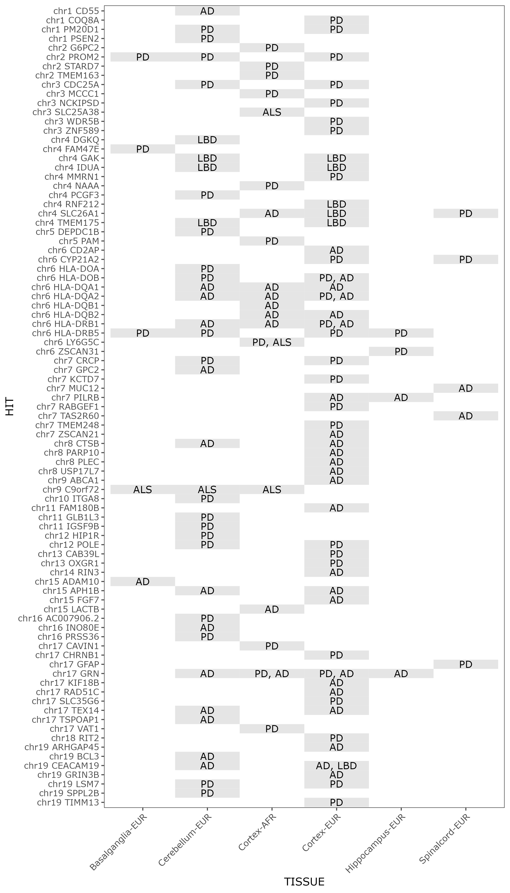

# Colocalization workflow
   
## Collecting significant tissue (eQTL GWAS) data
Generate full tissue eQTL GWAS files using [`retrieve-smr.sh`](src/retrieve-smr.sh). Importantly, the
script calls a `smr-1.3.1` binary with `--descriptive-cis` `--beqtl-summary` to generate output.

This loop iterates through (tissue) x (chromosomes 1:22) to query compressed `.besd` files. Records
passing the defined p-value significance threshold (in this case `1e-4`) are concatenated into a
single file per study, `data/eQTL/${TISSUE}.signif.tsv`.

```bash
TISSUES=(Basalganglia-EUR Cerebellum-EUR Cortex-AFR Cortex-EUR Hippocampus-EUR Spinalcord-EUR)
THRESHOLD='1e-4'
for tissue in ${TISSUES[@]}; do
    bash src/retrieve-smr.sh ${tissue} ${THRESHOLD}
done
```


## Collecting significant NDD GWAS data
This loop iterates through `${DATADIR}`, which currently contains multiple NDD GWAS files with
varied column order and ID. The function `filterPvalByR` envokes an `R` heredoc to read in the
complete GWAS, then output a consistent set of columns, with rows filtered by p-value significance.

```bash
filterPvalByR() {
Rscript - ${1} ${2} ${3} <<EOF
    #!/usr/bin/env Rscript
    library(data.table)
    args <- commandArgs(trailingOnly=TRUE)
    infile <- args[1]
    threshold <- as.numeric(args[2])
    outfile <- args[3]

    dat <- fread(infile)
    desired_cols <- c('SNP','CHR','BP','A1','A2','BETA','FRQ','SE','P')
    dat <- dat[P < threshold, .SD, .SDcols=desired_cols]
    fwrite(dat, file=outfile, quote=F, row.names=F, col.names=T, sep='\t')
EOF
}

DATADIR='/gpfs/gsfs8/users/CARD_AA/projects/2022_10_CA_singlecell_humanbrain/data/final_formatted_sumstats'
OUTDIR='data/NDD'
THRESHOLD='5E-8'

for infile in ${DATADIR}/*; do
    outfile=$(basename ${infile%.formatted.tsv}.signif.tsv)
    filterPvalByR ${infile} ${THRESHOLD} ${OUTDIR}/${outfile}
done
```


## Defining clusters for colocalization analysis

First, retrieve a `.bed` file containing the human recombination map:
```bash
RECOMBINATION_BED='data/genetic_map_hg38_withX.txt.gz'
wget -O ${RECOMBINATION_BED} https://storage.googleapis.com/broad-alkesgroup-public/Eagle/downloads/tables/genetic_map_hg38_withX.txt.gz
```

Then iterate over (signifcance-filtered) summary stats files to define
local clusters to be fed into colocalization analysis:
```bash
NDD_FILES=($(ls data/NDD/*signif.tsv))
for ndd_gwas in ${NDD_FILES[@]}; do
    Rscript src/find_clusters.R ${ndd_gwas} ${RECOMBINATION_BED}
done
```

## Running iterative colocalization
Iterate over (eQTL x NDD GWAS) pairs and perform colocalization analysis
for all local clusters defined in the previou section.
```bash
eQTL_FILES=($(ls data/eQTL/*signif.tsv.gz))
NDD_FILES=($(ls data/NDD/*signif.tsv))

for eQTL_file in ${eQTL_FILES[@]}; do 
    for ndd_gwas in ${NDD_FILES[@]}; do
        clusterfile="data/NDD/clusters/$(basename ${ndd_gwas[0]%.signif.tsv}.clusters_chosen.tsv)"
        Rscript src/run-coloc.R ${eQTL_file} ${ndd_gwas} ${clusterfile}
    done
done
```

## Combining results files
Concatenating files
```bash
OUTFILE='data/coloc/ALL_COLOC.tsv'
INFILES=($(ls data/coloc/*.tsv))

if [ -f "${OUTFILE}" ]; then rm ${OUTFILE}; fi

head -n 1 ${INFILES[0]} > ${OUTFILE}

for file in ${INFILES[@]}; do
    awk 'NR>1' ${file} >> ${OUTFILE}
done
```

# Generate hit summary tables
```R
library(data.table)
dat <- fread('data/coloc/ALL_COLOC.tsv')

all_hits <- dcast(dat[, .N, by=list(NDD,TISSUE)], NDD~TISSUE)
gene_hits <- dcast(dat[, .N, by=list(NDD,TISSUE,GENE)][, .N, by=list(NDD,TISSUE)], NDD~TISSUE)

fwrite(all_hits, file='data/coloc/hit_all_summary.tsv', quote=F, row.names=F, col.names=T, sep='\t')
fwrite(gene_hits, file='data/coloc/hit_gene_summary.tsv', quote=F, row.names=F, col.names=T, sep='\t')
```

Adding gene ID column
```R
library(data.table)
dat <- fread('data/coloc/ALL_COLOC.tsv')
gids <- fread('data/coloc/GENEIDS.csv', col.names=c('PROBE','GENEID'))
dat <- merge(dat, unique(gids), by='PROBE')
setnames(dat, 'B', 'eQTL_B')

desired_cols <- c('CHR','BP','NDD','TISSUE','GENEID','SNP.PP.H4','eQTL_B','PROBE','PROBE_BP','SNP','A1','A2','FREQ')
dat.out <- dat[, .SD, .SDcols=desired_cols][order(CHR,BP,NDD,TISSUE)]
fwrite(dat.out, file='coloc_formatted.tsv', quote=F, row.names=F, col.names=T, sep='\t')
```

Heat-map of hits
```R
library(data.table)
library(ggthemes)
library(ggplot2)
dat <- fread('coloc_formatted.tsv')
dat <- dat[!NDD %like% '_no']

dat.ag <- dat[, .N, by=list(NDD, TISSUE, GENEID,CHR)][order(CHR,GENEID)]

dat.wide <- dcast(dat.ag, TISSUE+GENEID+CHR~NDD, value.var='N')

dat.wide[! is.na(AD_Bellenguez), AD := 'AD']
dat.wide[! is.na(ALS_vanRheenen), ALS := 'ALS']
dat.wide[! is.na(LBD_Chia), LBD := 'LBD']
dat.wide[! is.na(PD_Nalls), PD := 'PD']
dat.wide[, txtlbl := apply(.SD, 1, function(x) paste(x[!is.na(x)], collapse = ", ")), .SDcols=c('PD','AD','ALS','LBD')]
dat.wide <- dat.wide[order(CHR,GENEID)]
dat.wide[, 'HIT' := paste0('chr', CHR, ' ', GENEID)]

dat.wide[, HIT := factor(HIT, levels=rev(unique(dat.wide$HIT)))]
dat.wide[CHR%%2==0, bckgrnd := 0]
dat.wide[CHR%%2==1, bckgrnd := 1]
dat.wide[, bckgrnd := rleid(CHR)]
dat.wide[, bckgrnd := factor(bckgrnd)]

g <- ggplot(dat.wide, aes(x=TISSUE, y=HIT, label=txtlbl)) + 
geom_tile(fill='gray90') +
geom_text() +
theme_few() +
theme(axis.text.x = element_text(angle = 45, hjust = 1, vjust = 1))


ggsave(g, file='coloc_hits_table.png', height=35, width=20, units='cm')
```

